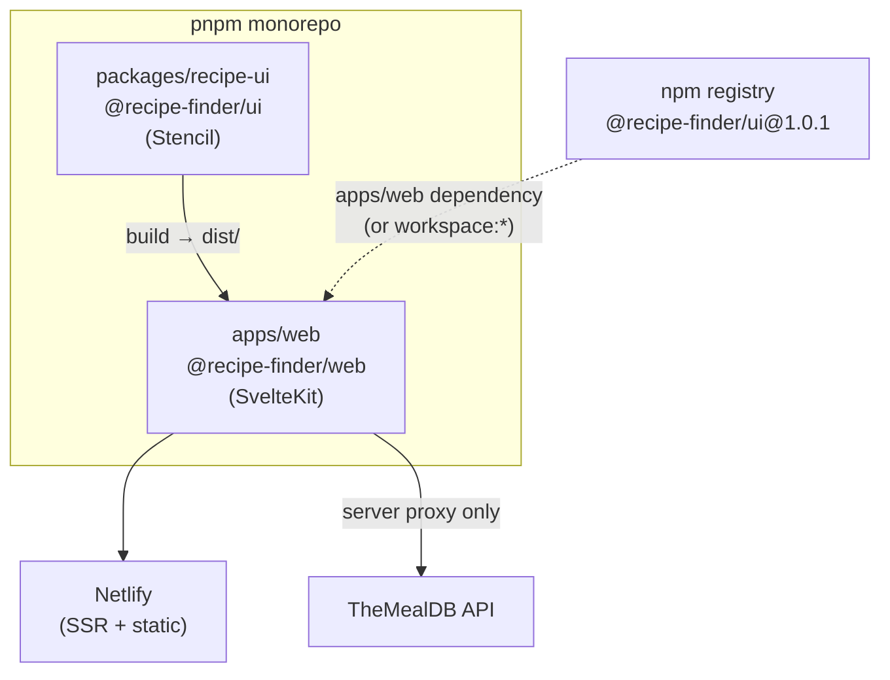
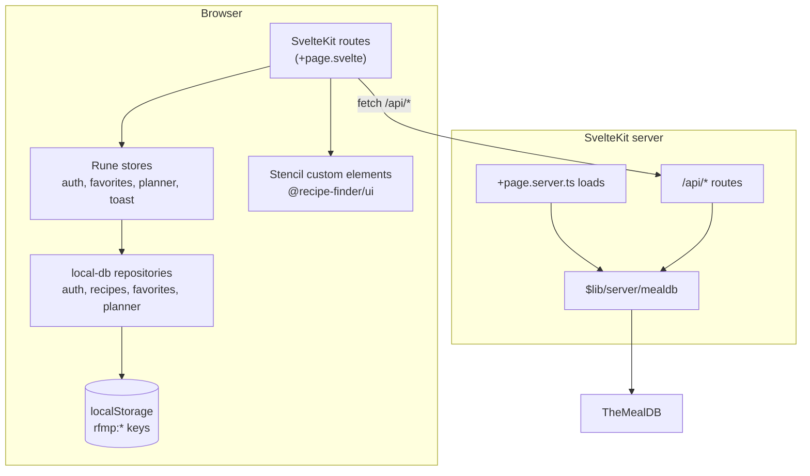
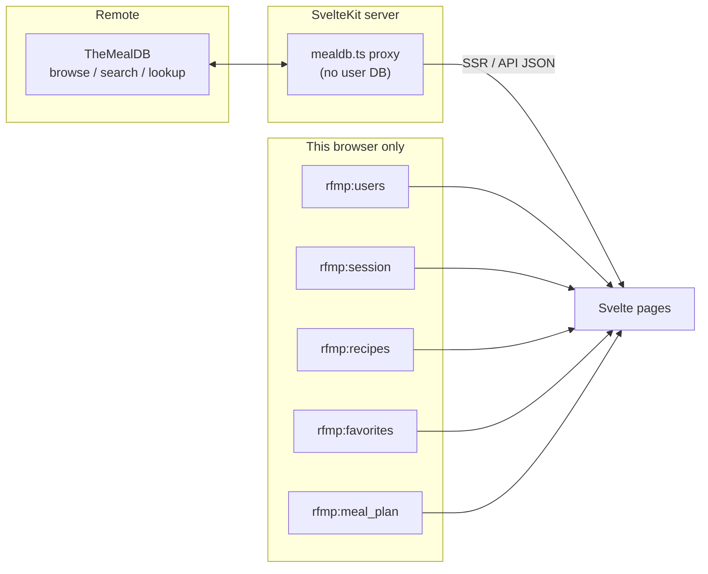
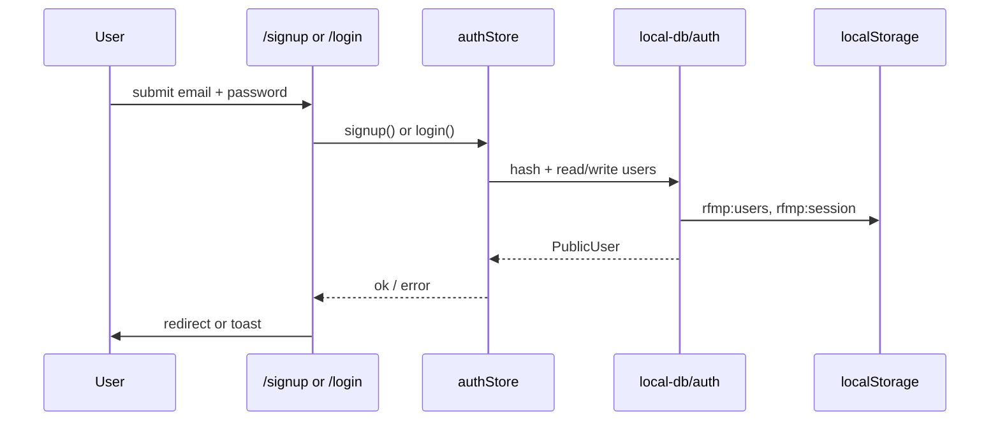
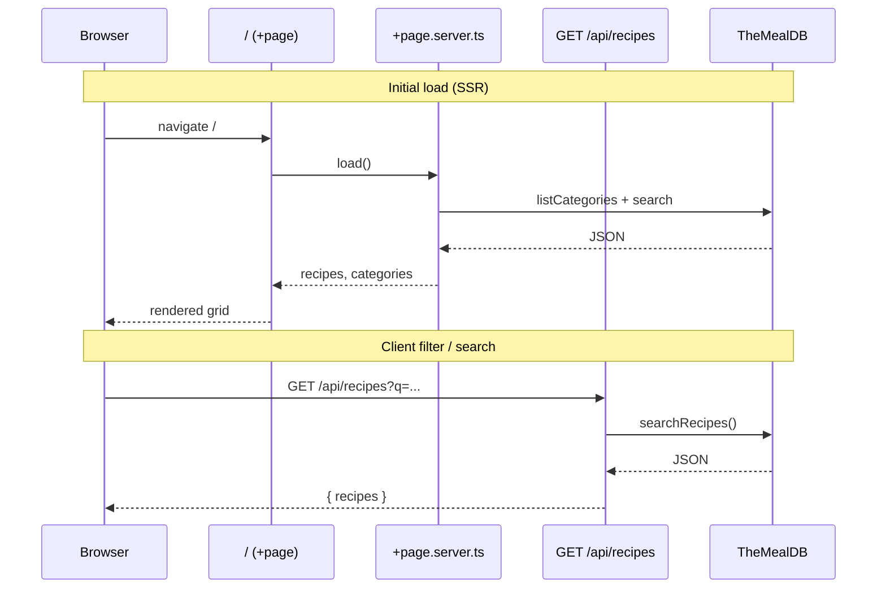
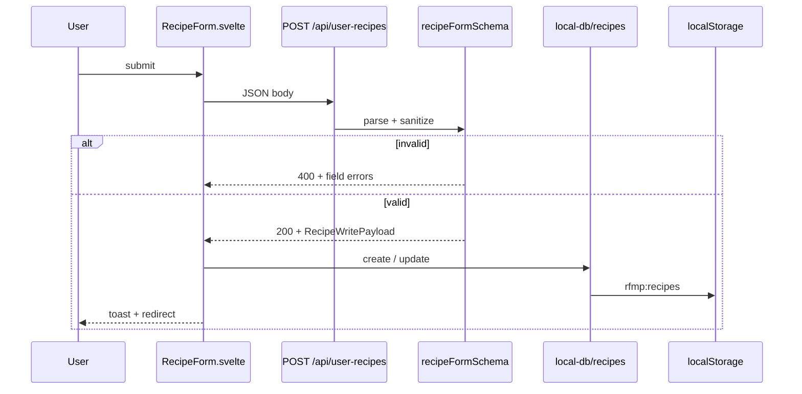
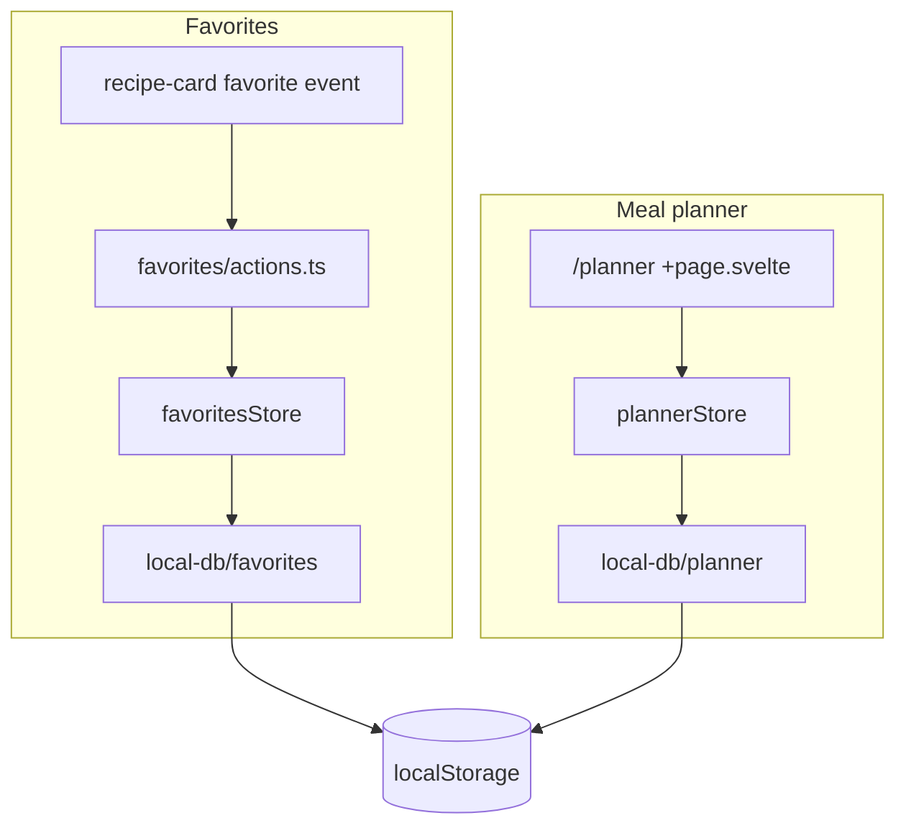
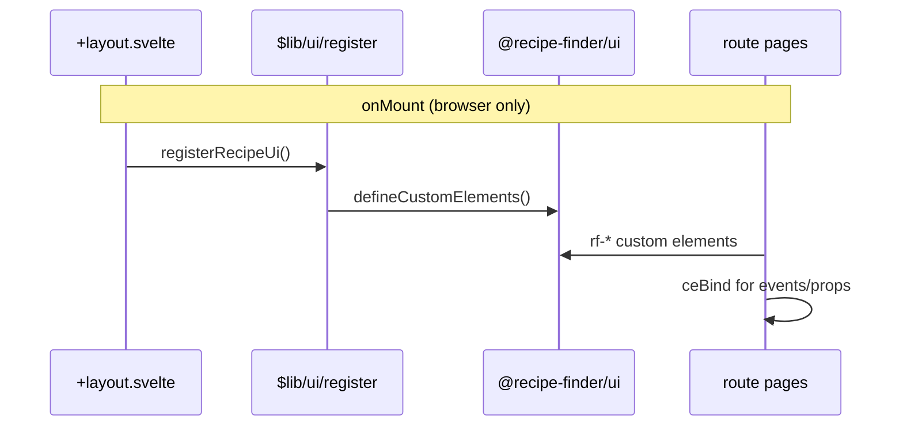

# Architecture & flow

High-level structure of the Recipe Finder & Meal Planner monorepo: how packages fit together, where data lives, and how requests move through the app.

For product assumptions, see [ASSUMPTIONS.md](./ASSUMPTIONS.md). For server validation details, see [server-side-validation.md](./server-side-validation.md).

---

## Monorepo overview

| Package | Role | Tech |
| --- | --- | --- |
| `packages/recipe-ui` | Presentational UI (custom elements) | Stencil |
| `apps/web` | App shell, routing, data orchestration | SvelteKit 2, Svelte 5 runes |

**Build order:** UI must build before web (`pnpm build` runs UI first).

---

## Application layers

| Layer | Responsibility |
| --- | --- |
| **Routes** | Pages, layout, navigation, compose UI |
| **Stores** | In-memory UI cache; hydrate from repositories on mount |
| **Repositories** (`$lib/local-db/`) | Read/write localStorage; filter by signed-in user |
| **`@recipe-finder/ui`** | Dumb components only — no fetch or persistence |
| **SvelteKit server** | Proxy TheMealDB, validate recipe form POSTs, SSR |

---

## Data storage model

| Data | Location | Sync |
| --- | --- | --- |
| TheMealDB catalog | Remote API (via server proxy) | Read-only |
| Accounts, session | localStorage | Per browser |
| User-created recipes | localStorage | Per browser |
| Favorites | localStorage | Per browser |
| Meal plan | localStorage | Per browser |

User-owned rows are scoped by `userId` / `ownerId` from the local session — never from untrusted form fields alone.

---

## Auth flow (client-only)

Sign-up and login run entirely in the browser. Passwords are hashed with Web Crypto SHA-256 (demo-grade, not production auth).

Logout clears `rfmp:session` only; user records remain in `rfmp:users`.

---

## Recipe discovery (TheMealDB)

Browse and search never call TheMealDB from the browser directly. The SvelteKit server proxies requests using `MEALDB_BASE_URL`.

Recipe IDs from TheMealDB use the `mealdb:` prefix (see `$lib/utils/ids.ts`).

---

## User recipe create / edit

The server validates the form; the client persists only after a successful response.

---

## Favorites & meal planner

Both features are **client-only** after auth. Stores mirror repository state for reactive UI.

Planner week data can be seeded from `+page.server.ts` (ISO week start); assignments and shopping list logic stay on the client.

---

## UI package integration

Stencil custom elements register once on the client. SSR bundles the package but does not run registration during server render.

For property binding, custom events, slots, and per-route usage, see **[sveltekit-stencil-integration.md](./sveltekit-stencil-integration.md)**.

Theme tokens load from `@recipe-finder/ui/global.css` in `app.css` (`--rf-*` variables).

---

## Related docs

- [ASSUMPTIONS.md](./ASSUMPTIONS.md) — local-first demo constraints
- [sveltekit-stencil-integration.md](./sveltekit-stencil-integration.md) — props, events, slots, and route usage
- [server-side-validation.md](./server-side-validation.md) — Zod rules and API contracts
- [publish-ui-package.md](./publish-ui-package.md) — npm vs workspace linking
