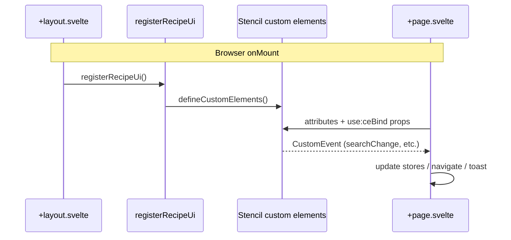

# SvelteKit + Stencil integration

How the SvelteKit app (`apps/web`) integrates the Stencil UI library (`packages/recipe-ui`, published as `@recipe-finder/ui`). The library ships **presentational custom elements only** — no fetching or persistence inside components.

For monorepo layout and registration flow, see [architecture.md](./architecture.md#ui-package-integration). For npm vs workspace linking, see [publish-ui-package.md](./publish-ui-package.md).

---

## Integration requirements

| Requirement | Status | How it is implemented |
| --- | --- | --- |
| Pass data from SvelteKit to Stencil components using **component properties** | **Done** | HTML attributes + `ceBind` action (`Object.assign` on the custom element) |
| Handle **custom events** emitted by Stencil components in SvelteKit | **Done** | `addEventListener` on route roots or modal refs; handlers read `CustomEvent.detail` |
| Use **slots** where applicable | **Done** | Slotted content from Svelte into `empty-state`, `rf-modal`, `recipe-grid`, `recipe-card` |
| Use Stencil components as part of the **main application experience** | **Done** | Core routes: home, favorites, planner, recipe detail, recipe form, global toast |

---

## Registration (client-only)

Custom elements register **once** when the app mounts in the browser. SSR may bundle the package but does not call `defineCustomElements()` during server render.

| File | Role |
| --- | --- |
| [`apps/web/src/lib/ui/register.ts`](../apps/web/src/lib/ui/register.ts) | Lazy `defineCustomElements()` from `@recipe-finder/ui` |
| [`apps/web/src/routes/+layout.svelte`](../apps/web/src/routes/+layout.svelte) | Calls `registerRecipeUi()` in `onMount` |
| [`apps/web/src/app.d.ts`](../apps/web/src/app.d.ts) | Minimal TypeScript for custom element tags in Svelte templates |

Theme tokens load from `@recipe-finder/ui/global.css` in `apps/web/src/app.css` (`--rf-*` variables).

---

## 1. Passing properties (SvelteKit → Stencil)

Stencil `@Prop()` fields are set in two ways:

### HTML attributes

Use kebab-case attribute names for simple, serializable props:

```svelte
<search-bar label="Search recipes" placeholder="Search recipes…" value={query} />

<recipe-card recipe-id={recipe.id} heading={recipe.title} image={recipe.image ?? ''} />
```

### `ceBind` action

For object/array props or camelCase Stencil props that do not map cleanly to attributes, use the `ceBind` Svelte action. It waits for the custom element to be defined, then assigns properties on the DOM node:

```ts
// apps/web/src/lib/ui/ce-bind.ts
Object.assign(node, current);
```

Example:

```svelte
<filter-chip-group
  label="Filters"
  use:ceBind={{ options: filterOptions, selected: selectedFilters }}
/>

<recipe-card
  recipe-id={recipe.id}
  heading={recipe.title}
  use:ceBind={{
    tags: recipeTags(recipe),
    cookTime: recipe.cookTimeMinutes ?? 0,
    favorited: favoritesStore.isFavorited(recipe.id)
  }}
/>
```

**Primary consumer:** [`apps/web/src/lib/ui/ce-bind.ts`](../apps/web/src/lib/ui/ce-bind.ts)

---

## 2. Handling custom events (Stencil → SvelteKit)

Stencil components emit DOM **CustomEvents** via `@Event()`. Svelte pages listen with `addEventListener` on a container (`bind:this={rootEl}`) or on a specific element (`bind:this={modalEl}`), because Svelte’s `on:` syntax does not always bind cleanly to Stencil event names.

Typical pattern:

```svelte
<script lang="ts">
  let rootEl = $state<HTMLElement | null>(null);

  onMount(() => {
    const root = rootEl;
    if (!root) return;

    root.addEventListener('searchChange', onSearch);
    root.addEventListener('recipeSelect', onRecipeSelect);
    root.addEventListener('favoriteToggle', onFavoriteToggle);

    return () => {
      root.removeEventListener('searchChange', onSearch);
      root.removeEventListener('recipeSelect', onRecipeSelect);
      root.removeEventListener('favoriteToggle', onFavoriteToggle);
    };
  });

  function onSearch(event: Event) {
    const value = (event as CustomEvent<{ value: string }>).detail?.value ?? '';
    // update Svelte state…
  }
</script>

<section bind:this={rootEl}>
  <search-bar … />
  <recipe-card … />
</section>
```

### Events used in the app

| Event | Source component(s) | Used on |
| --- | --- | --- |
| `searchChange`, `searchSubmit` | `search-bar` | `/`, `/planner` (picker) |
| `filterChange` | `filter-chip-group` | `/`, `/planner` (picker) |
| `recipeSelect` | `recipe-card` | `/`, `/favorites`, `/planner` |
| `favoriteToggle` | `recipe-card` | `/`, `/favorites`, `/planner` |
| `valueChange` | `form-input` | `RecipeForm.svelte` |
| `close`, `confirm` | `rf-modal` | `/planner`, `/recipe/[id]` |

Event names and payload shapes are generated in [`packages/recipe-ui/src/components.d.ts`](../packages/recipe-ui/src/components.d.ts).

---

## 3. Slots

Several Stencil components expose default slots. Svelte passes children as slotted content:

| Component | Slot purpose | Example in app |
| --- | --- | --- |
| `empty-state` | Action link or button below message | “Create a recipe” link on `/` |
| `rf-modal` | Dialog body | Delete confirmation copy, plan form, recipe picker |
| `recipe-grid` | Grid children | `{#each}` of `recipe-card` elements |
| `recipe-card` | Optional footer | Defined in library; used where needed |

Example — slotted empty-state action:

```svelte
<empty-state icon="search" message="No recipes match that search.">
  <a href="/recipe/new">Create a recipe</a>
</empty-state>
```

Example — slotted modal body:

```svelte
<rf-modal use:ceBind={{ open: planOpen }}>
  <p>Week of {weekLabel}</p>
  <label>…</label>
</rf-modal>
```

The library also defines `day-column` with a slot for empty-cell content; the current planner page uses a custom Svelte grid for the weekly layout instead, but still uses other Stencil components for pickers and modals.

---

## 4. Where components appear in the app

| Route / area | Stencil components |
| --- | --- |
| `/` (discovery) | `search-bar`, `filter-chip-group`, `recipe-card`, `recipe-grid`, `empty-state` |
| `/favorites` | `recipe-card`, `recipe-grid`, `empty-state` |
| `/planner` | `rf-modal`, `search-bar`, `filter-chip-group`, `recipe-card`, `recipe-grid`, `empty-state` |
| `/recipe/[id]` | `empty-state`, `rating-stars`, `rf-modal` |
| `/recipe/new`, `/recipe/[id]/edit` | `form-input` (via `RecipeForm.svelte`) |
| Global layout | `toast-notification` |


## Flow overview



---

## Related docs

- [architecture.md](./architecture.md) — monorepo layers and UI registration sequence
- [ASSUMPTIONS.md](./ASSUMPTIONS.md) — presentational-only UI library
- [publish-ui-package.md](./publish-ui-package.md) — building and publishing `@recipe-finder/ui`
